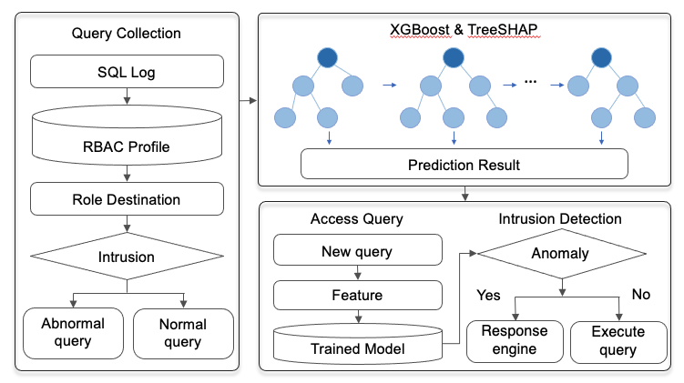
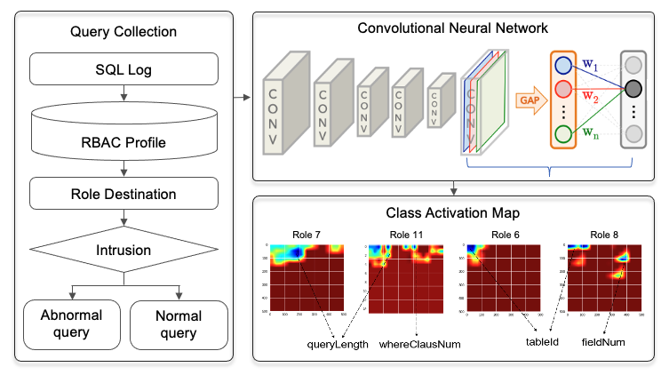

# Insider Data Exfiltration Detection via Explainable Artificial Intelligence

#### "Insider Data Exfiltration Detection via Explainable Artificial Intelligence" explores using AI to detect internal data breaches. The research emphasizes creating transparent, understandable AI models for reliable, interpretable security solutions.

## Explainable Artificial Intelligence Architecture

#### In phase 1, XGBoost - TreeSHAP

#### In phase 2, Convolutional Neural Networks - Class Activation Map

## Dataset 
#### Due to security reasons, we are unable to publicly disclose the data used in our experiment, so only sample data has been uploaded. We plan to send the full data set to Professor Kim Hyung-sik via email after seeking his understanding to comply with security protocols.
